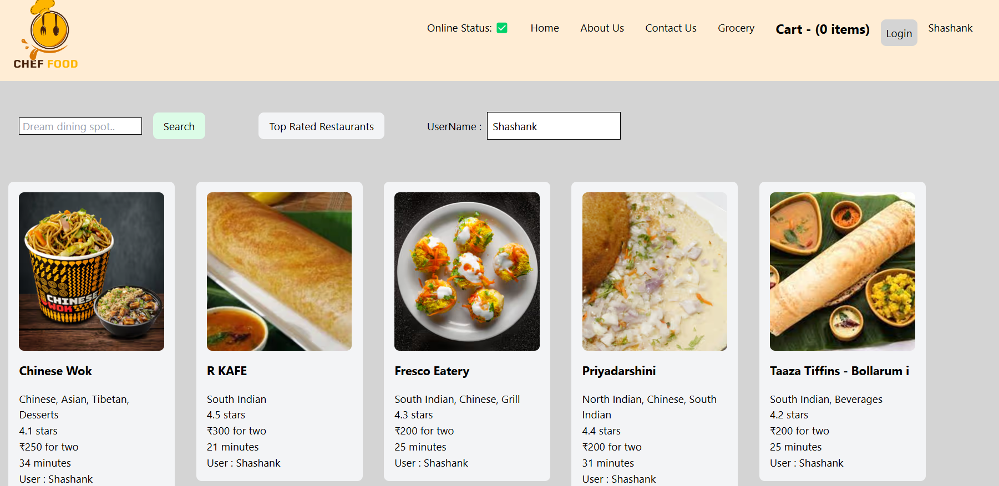
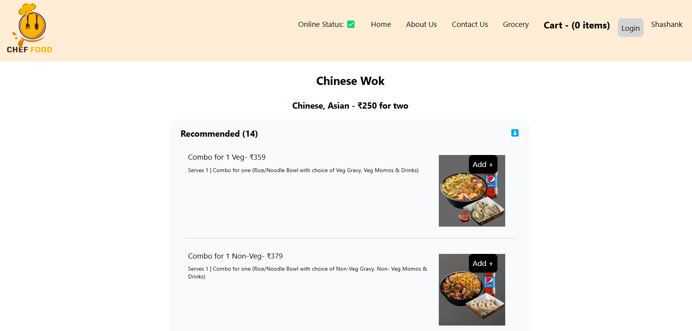
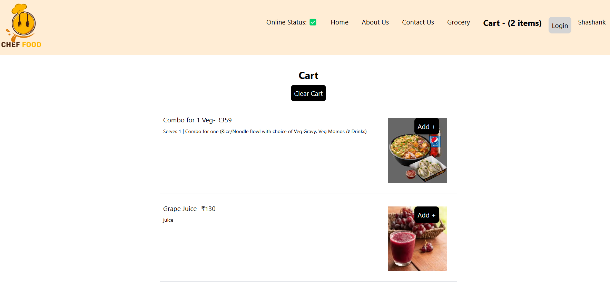

# Cravings 🍽️

Cravings is my first learning project where I explored core React concepts like React Hooks, Tailwind CSS, Redux, and API handling. This project showcases restaurant data, including restaurant names, their menus, and allows users to add or remove items from the cart. Through Cravings, I gained a deeper understanding of React and enhanced my knowledge of essential web development concepts.

---

## **Features**
- **Restaurant Listings**: Display a list of restaurants and their menu items.
- **Cart Functionality**: Add and remove items from the cart.
- **Real-time API Integration**: Fetch restaurant data using the Swiggy API based on the user's locality.
- **State Management**: Manage the application state with Redux and Redux Toolkit.
- **Responsive UI**: Built a smooth and responsive user interface using Tailwind CSS.
- **React Hooks & Routing**: Leveraged React Hooks for state management and API handling, and implemented React Router for page navigation.

---

## **Technologies Used**
- **React**: For building the user interface and managing components.
- **Tailwind CSS**: For styling and creating a responsive design.
- **Redux & Redux Toolkit**: For state management across the application.
- **Swiggy API**: For fetching live restaurant data based on locality.
- **Jest**: For testing the application functionality.

---

## **Learnings**
During the development of Cravings, I gained hands-on experience in:
- **React Project Setup**: Building a React app from scratch.
- **JSX and React Components**: A deep dive into JSX and creating functional components.
- **Tailwind CSS**: Setting up and using Tailwind CSS for responsive design.
- **React Hooks**: Understanding and applying various hooks like `useState`, `useEffect`, and `useContext`.
- **React Router**: Implementing page navigation using React Router.
- **API Handling**: Fetching and managing real-time API data.
- **Redux & Redux Toolkit**: Understanding the principles of Redux for global state management.
- **Testing**: Writing tests for components using Jest.

---

## **Installation**

1. Clone the repository:
   ```bash
   git clone https://github.com/shashankmomula/Cravings.git
   cd Cravings
   ```

2. Install dependencies:
   ```bash
   npm install
   ```

3. Run the development server:
   ```bash
   npm start
   ```

---

## **Learning Outcomes**
- Gained a solid understanding of **React Hooks** and their use in managing state and side effects.
- Learned to fetch data from APIs and handle asynchronous operations effectively.
- Enhanced skills in global state management using **Redux** and **Redux Toolkit**.
- Improved UI styling skills using **Tailwind CSS**, creating a responsive and user-friendly design.

---

### 1. Restaurant Listing


### 2. Menu Display


### 3. Cart Functionality


## **Live Demo**
You can access the live demo of the project [here](https://cravingss.netlify.app).

## **Contributing**
Feel free to fork the repository, open issues, and submit pull requests for improvements. Your contributions are highly welcome!

---
